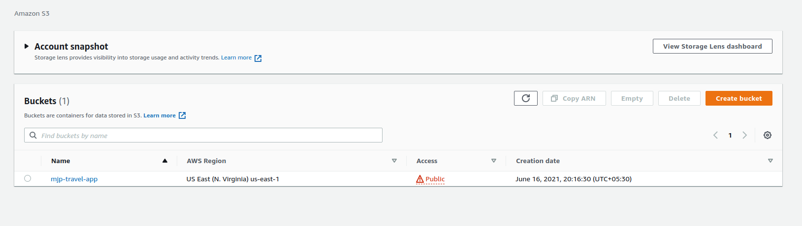
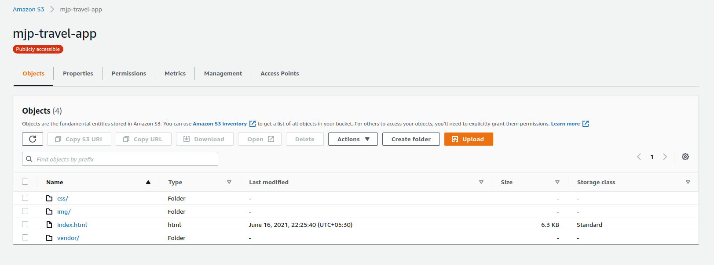
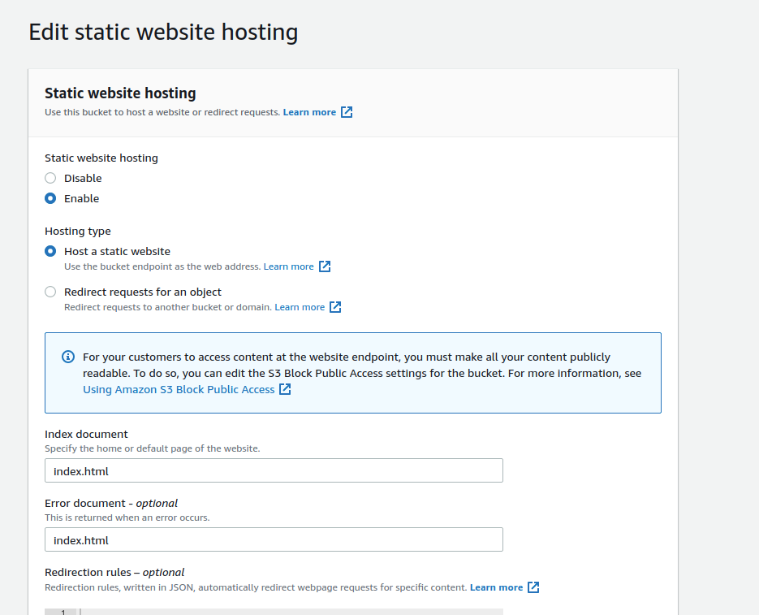
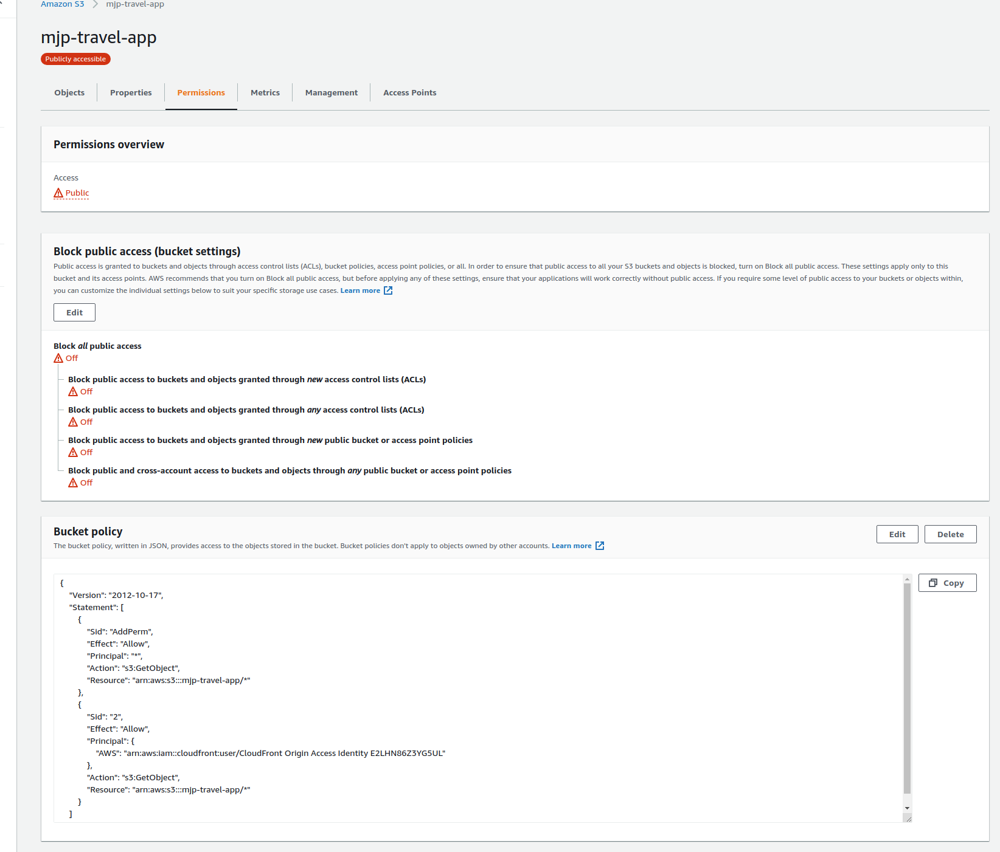
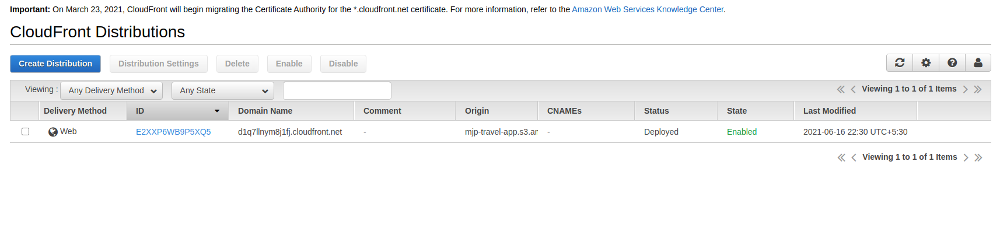

## Deploy Static Website on AWS

In this sample project, a static website was deployed to AWS using S3, CloudFront, and IAM.

The files included are: 

index.html - The Index document for the website.
/img - The background image file for the website.
/vendor - Bootssrap CSS framework, Font, and JavaScript libraries needed for the website to function.
/css - CSS files for the website.

## References
### Create and configure S3

### Upload the files to S3

### Static Hosting Configuration

### IAM configuration

### Cloud Front Creation

### Website screenshot

